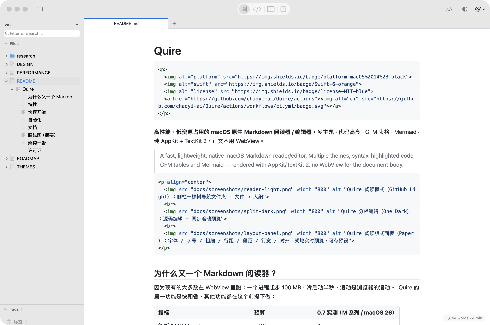

# Quire

<p>
  
  
  
  <a href="https://github.com/chaoyi-ai/Quire/actions"></a>
</p>

**高性能、低资源占用的 macOS 原生 Markdown 阅读器 / 编辑器。**
多主题 · 代码高亮 · GFM 表格 · Mermaid · 纯 AppKit + TextKit 2，正文不用 WebView。

> A fast, lightweight, native macOS Markdown reader/editor. Multiple themes, syntax-highlighted code, GFM tables and Mermaid — rendered with AppKit/TextKit 2, no WebView for the document body.

<p align="center">
  
  <br>
  
</p>

## 为什么又一个 Markdown 阅读器？

因为现有的大多数在 WebView 里跑：一个进程起步 100 MB、冷启动半秒、滚动是浏览器的滚动。
Quire 的第一功能是**快和省**，其他功能都在这个前提下做：

| 指标 | 预算 | 0.1 实测（M 系列 / macOS 26） |
|------|------|------|
| 解析 1 MB Markdown | < 60 ms | 42 ms |
| 解析 + 渲染 1 MB Markdown | < 200 ms | 160 ms |
| 编辑回显（1 MB 文档中段修改） | < 16 ms | 1.4 ms |
| 热启动到首帧 | < 400 ms（目标 300） | 350–400 ms |
| 常驻内存（典型文档 / 1 MB 文档） | < 40 / 120 MB | 40 / 90 MB |
| 空闲 CPU | 0% | 0% |
| App 体积（含 Mermaid） | < 15 MB | 6.5 MB |
| 进程数（不含 Mermaid 渲染期间） | 1 | 1 |

完整预算与测量方法见 [docs/PERFORMANCE.md](docs/PERFORMANCE.md)。

## 特性

- **原生渲染**：AppKit + TextKit 2，选择 / 查找 / 打印 / 辅助功能全是系统级
- **完整 Markdown**：CommonMark + GFM（表格、任务列表、删除线、自动链接、脚注）
- **代码高亮**：自研轻量词法器，30+ 语言，无 JS 运行时
- **Mermaid**：唯一使用 WebKit 的地方——惰性、离屏、渲染完销毁、结果缓存
- **多主题**：10 套内置（GitHub / Paper / Solarized / Nord / Dracula / One Dark / Gruvbox），JSON 自定义主题、热切换、跟随系统明暗
- **侧栏**：目录树 → Markdown 文件 → 文件内大纲，一棵树导航整个文件夹；懒加载、FSEvents 监听、其他文件大纲快速扫描（不做完整解析）
- **阅读器**：外部修改自动刷新（保持滚动位置）、缩放、查找、打印
- **编辑器**：源码编辑 + Markdown 高亮、行号、列表/围栏/引用续行、⌘B/I/K/E、分栏同步滚动、块级增量预览（击键 → 预览 1.4 ms）
- **导出**：HTML（内联主题 CSS）、PDF（按块边界分页）
- **可视化编辑**（M5）：行内实时预览

## 快速开始

下载：[Releases](https://github.com/chaoyi-ai/Quire/releases)（`Quire-x.y.z.zip`，ad-hoc 签名；首次打开需右键 → 打开）。

从源码：

```bash
git clone https://github.com/chaoyi-ai/Quire.git && cd Quire
scripts/build_app.sh          # 拉取 mermaid.min.js → swift build -c release → dist/Quire.app
open dist/Quire.app
```

开发：

```bash
swift build                    # 编译全部
swift test                     # QuireCore / QuireRender 单元测试
swift run -c release quire-bench all   # 性能基准
open Package.swift             # 用 Xcode 开发
```

要求：macOS 14+，Xcode 16+ / Swift 6。

## 文档

| 文档 | 内容 |
|------|------|
| [docs/DESIGN.md](docs/DESIGN.md) | 架构、关键决策（ADR）、渲染管线、模块划分 |
| [docs/PERFORMANCE.md](docs/PERFORMANCE.md) | 性能预算、原则、禁止事项、基准工具 |
| [docs/THEMES.md](docs/THEMES.md) | 主题 JSON 规范、内置主题、自定义主题 |
| [docs/ROADMAP.md](docs/ROADMAP.md) | 里程碑 M0–M6 与任务拆分 |
| [CONTRIBUTING.md](CONTRIBUTING.md) | 构建、测试、提交约定 |

## 路线图（摘要）

| 里程碑 | 交付 |
|--------|------|
| ✅ M0 基础设施 | 仓库、文档、SwiftPM 骨架、CI、主题、基准数据 |
| ✅ M1 阅读器 MVP | 原生渲染基础块 + 代码高亮 + 主题 + 目录 + 自动重载 |
| ✅ M2 表格 + Mermaid | 原生表格、Mermaid 离屏渲染 + 缓存 |
| ✅ M3 编辑器 | 源码编辑、分栏同步预览、增量渲染 |
| ✅ M4 性能与打磨 | 基准门禁、启动优化、大文件模式、设置、导出、0.1 发布 |
| M5 可视化编辑 | 行内实时预览、数学、本地化、1.0 |
| M6 写作工作台 | 对标 Typora：表格 / 图片就地编辑、快速打开、全局搜索、字数、剪贴板互通（[调研](docs/research/typora.md)） |

详见 [docs/ROADMAP.md](docs/ROADMAP.md) 与 [GitHub Milestones](https://github.com/chaoyi-ai/Quire/milestones)。

## 架构一瞥

```
Quire (App: NSDocument · 窗口 · 侧栏 · 编辑器 UI)
  └─ QuireRender (AppKit: Block → NSAttributedString · TextKit 2 视图 · 表格附件 · Mermaid · 图片)
       └─ QuireCore (Foundation only: 解析 · 块模型 · 增量 diff · 主题 · 高亮 · 大纲)
            └─ cmark-gfm (C) · CQuireAttr (ObjC 直通，40 行)
```

## 许可证

[MIT](LICENSE)
