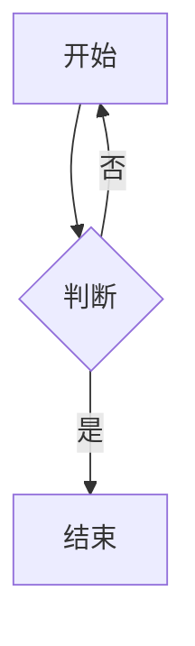

# Quire 示例文档

这是一个 **粗体**、*斜体*、~~删除线~~、`行内代码` 和 [链接](https://example.com "标题") 的段落。裸链接 https://github.com/chaoyi-ai/Quire 也会被识别。

## 列表

- 无序一
- 无序二
  - 嵌套
- [x] 已完成
- [ ] 未完成

1. 有序一
2. 有序二

## 引用

> 引用第一层
> > 引用第二层

## 代码

```swift
import Foundation

/// 文档注释
struct Point: Hashable {
    let x: Double, y: Double
    func distance(to other: Point) -> Double {
        ((x - other.x) * (x - other.x) + (y - other.y) * (y - other.y)).squareRoot() // 0.5
    }
}
let p = Point(x: 1, y: 2)
print("距离 \(p.distance(to: Point(x: 0, y: 0)))")
```



## 表格

| 左对齐 | 居中 | 右对齐 |
|:-------|:----:|-------:|
| a      | b    | c      |
| **粗** | `码` | [链](x) |

---


<div align="center">HTML 块</div>

## 重复标题

## 重复标题
